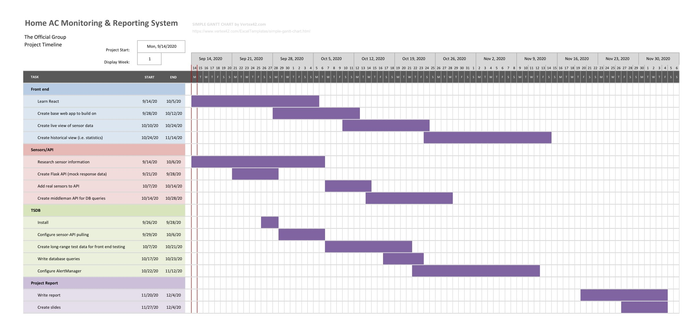

# The Official Group

### Project Proposal (WIP)
**Purpose:** to expose health and usage information of residential air-conditions systems to predict maintenance and failure

**Filter change prediction**  
Using a manifold air pressure (MAP) sensor between the filter and the blower, we can determine how dirty the filter is, and project over time when it will need to be replaced.  We can send email alerts (perhaps with filter spec information, and even a purchase link).  

**Temperature differential measurements**  
By measuring the difference between the outgoing and return air temperatures, we can determine if the A/C unit is cooling effectively.  The ideal temperature differential is between 16 and 22 degrees.  This temperature difference is the "evaporator Delta T".  If the delta T is too high, it indicates their is an air-flow restriction (dirty filter, clogged evaporator core, ducting problem).  If delta T is too low, it is likely low refrigerant, leaky ducting, leaking reverse valve or compressor issues.  Regardless of the root cause, tracking the shift of delta-T over time will provide a means of detecting an issue well ahead of the unit failing, perhaps even allowing one to roughly predict when failure will occur.  An example would be if there is a slow refrigerant leak;  when the unit is first used after winter, the statistics will expose a pending issue even though the unit appears to be functioning well in terms of cooling the house.

**Run-times and energy usage**  
In a multi-zone house, it is possible that children may adjust A/C set-points to unreasonable settings, causing long run-times even though the A/C unit is functioning properly.  Tracking run-times and reporting anomalies.  Optionally, we can monitor the call signals to the zone controller as opposed to just the unit call signal.  This will identify which zones are calling at abnormal frequencies or durations.  We will need to capture call signals at the zone controller, as different zones have different flow characteristics and will perturb our delta-t measurement.  We will need to determine through observation how these interact.  

**Optional: Smart t-stat integration**  
Integrating with REST APIs provided by smart thermostat makers such as Nest and Honeywell, one can monitor set-points and schedules, and alert when settings are set to unreasonable values.  

**Structure**  
RPi provides a REST interface via [Flask](https://flask.palletsprojects.com/en/1.1.x/quickstart/) (or [Django-REST](https://www.django-rest-framework.org/)) server to expose measurement data, but does not store the data in a TSDB. Optionally, it may store data in a deque until fetched.  App will provide TSDB ([Prometheus](https://prometheus.io/docs/introduction/overview/)? [Graphite](https://graphite.readthedocs.io/en/stable/overview.html)?) insertion.  

**Statistics for web app**  
The purpose of the web application will be primarily to view useful statistics over an arbitrary range (perhaps disjoint, e.g. last 3 summers). It should also allow configuring alert trigger thresholds. Useful statistics include: average daily runtime, count of on-off cycles, average temperature differential, daily temperature differential variance, average air pressure, [weather data](https://openweathermap.org/price), and more.

